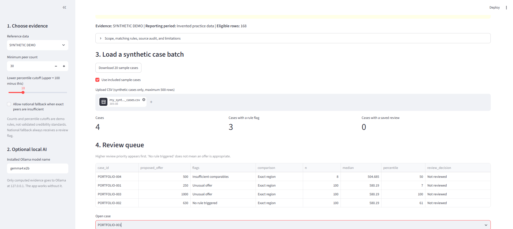

# IDR Review Workbench — beginner build guide

This project turns a batch of **synthetic** No Surprises Act IDR cases into a review queue. It finds historical CMS decided-dispute line items with the same code, place of service, geography, service year, and modifier; computes descriptive benchmarks; flags weak comparisons and unusual proposed amounts; lets a human record whether the comparison is usable; and exports an evidence packet.

**[Try the live NSA Review Workbench](https://nsa-review-workbench.streamlit.app/)** — explore the complete synthetic benchmarking, exception-review, human-approval, and evidence-export workflow without installing anything; optional AI drafting runs locally through Ollama.



## Executive summary

The IDR Review Workbench is a healthcare AI portfolio prototype demonstrating how public CMS data, deterministic analytics, a constrained local language model, and human review can work together in a high-stakes workflow.

It does not ask an LLM to calculate benchmarks or decide an appropriate payment. Python performs the matching, validation, percentile calculations, and rule-based flagging. The local model receives only computed facts and drafts an explicitly unverified explanation. A human reviewer evaluates the comparison before an evidence packet is exported.

### What this project demonstrates

- **Healthcare-domain reasoning:** Applies federal No Surprises Act IDR data to a narrowly defined offer-review use case.
- **Deterministic analytics:** Exact matching, explicit fallback rules, minimum peer-count requirements, percentiles, and reproducible flags.
- **Responsible AI architecture:** The model cannot alter calculations, recommend payment, predict an outcome, or access raw CMS rows.
- **Human-in-the-loop controls:** Review decisions and rationales are recorded separately from AI-generated text.
- **Auditability:** Source hashes, filters, settings, inputs, results, AI prompts, model metadata, reviews, and reference data are preserved in an exportable evidence packet.
- **Local-model evaluation:** Small Ollama models are tested for factual accuracy, terminology, fallback disclosure, formatting, and instruction adherence.

### Architecture

1. A synthetic case batch is validated against the supported scope.
2. Python matches each case to eligible historical CMS decided-dispute observations.
3. The deterministic engine calculates peer counts, selected-offer percentiles, and review flags.
4. An optional local Ollama model drafts a short explanation from computed facts only.
5. A human determines whether the comparison is usable for descriptive context.
6. The application exports a reproducible evidence packet.

> **Important:** This is a portfolio prototype using synthetic case inputs. Historical IDR outcomes are descriptive context—not fair-payment evidence, legal advice, or payment recommendations.

Built by [George Nessim](https://www.linkedin.com/in/george-nessim/),  Claude Certified Architect – Professional.

The language model does not calculate the benchmark and does not recommend a payment. Python calculates the numbers. The optional local model drafts a short explanation from those calculated facts.

## What you will have when you finish

- A local website built with Streamlit.
- A repeatable import of the public CMS QPA-and-offers file.
- A batch review queue for 20 synthetic cases.
- Three transparent flags: missing/invalid input, insufficient comparables, and unusual offer. A national fallback, if enabled, is also flagged.
- A case screen showing the exact comparison and calculations.
- An optional explanation generated locally through Ollama.
- Human-review history saved in SQLite.
- A ZIP evidence packet containing inputs, source manifest, prepared evidence, settings, results, reviews, and AI drafts.
- Thirteen known-answer tests you can show an interviewer.

This first version deliberately supports only **CPT 99284, place of service 23, single line items, non-default decisions, and healthcare-provider initiated disputes**. Narrow scope makes the matching logic inspectable. The initiating-party field is only a coarse proxy; it does not prove the underlying claim is professional rather than facility.

## Tools and links

| Tool | Purpose | Link |
|---|---|---|
| VS Code | Edit files and use the terminal | https://code.visualstudio.com/Download |
| Python 3.12 | Run the application | https://www.python.org/downloads/ |
| Python extension for VS Code | Python support inside VS Code | https://marketplace.visualstudio.com/items?itemName=ms-python.python |
| Git | Save versions and publish code | https://git-scm.com/download/win |
| Streamlit | Turn Python into a local web app | https://docs.streamlit.io/get-started/installation/command-line |
| Ollama | Run an optional model locally | https://ollama.com/download |
| Gemma 4 E2B | Small local model used in this guide | https://ollama.com/library/gemma4:e2b |
| CMS IDR reports | Official public data downloads | https://www.cms.gov/initiatives/no-surprise-billing/overview/policies-resources/independent-dispute-resolution-reports |
| Era by Eon | Optional simulated enterprise for later MCP testing | https://console.era.eon.io/invite.html?a=ofir-ehrlich |
| Era documentation | What Era does and its limitations | https://console.era.eon.io/docs.html |

Python, pandas, SQLite, Streamlit, and Ollama are available without a paid API. Gemma has its own model license; review it before redistribution. Era is an external service that is currently advertised as free for builders, not part of the open-source runtime.

## Words used in this guide

- **Terminal:** a window where you type commands.
- **Folder:** a place containing this project's files.
- **Virtual environment:** a private box for this project's Python packages.
- **Reference data:** historical public CMS line items used for comparison.
- **Case batch:** the synthetic cases you want the app to review.
- **Peer group:** historical line items selected by the matching rule.
- **Flag:** a reason for human review, not a payment decision.
- **Localhost:** a website available only on your computer.

## Phase 1 — get the starter folder into VS Code

1. Download and unzip `idr-review-starter.zip`.
2. Move the unzipped `idr-review-starter` folder somewhere simple, such as `Documents\idr-review-starter`.
3. Open VS Code.
4. Select **File → Open Folder**.
5. Choose the `idr-review-starter` folder, then select **Select Folder**.
6. If VS Code asks whether you trust the authors, choose **Yes** only if you obtained the ZIP from this chat and its contents match the files described here.
7. Select **Terminal → New Terminal**. The bottom of VS Code should show a prompt ending in `idr-review-starter>`.

Confirm Python is installed:

```powershell
python --version
```

You should see Python 3.12.x. If Windows says Python cannot be found, install it from the link above, check **Add python.exe to PATH** during installation, close VS Code, and reopen it.

## Phase 2 — create the private Python environment

In the VS Code terminal, enter each command and press Enter.

```powershell
python -m venv .venv
```

Activate it:

```powershell
.venv\Scripts\Activate.ps1
```

Your prompt should now begin with `(.venv)`. If PowerShell says scripts are disabled, run this once in the same terminal:

```powershell
Set-ExecutionPolicy -Scope Process -ExecutionPolicy Bypass
.venv\Scripts\Activate.ps1
```

This change lasts only for that terminal window.

Tell VS Code to use this environment:

1. Press `Ctrl+Shift+P`.
2. Type **Python: Select Interpreter**.
3. Choose the interpreter containing `.venv`.

Install the packages:

```powershell
python -m pip install --upgrade pip
python -m pip install -r requirements.txt
```

## Phase 3 — run the included synthetic demonstration

Create the invented reference data and sample cases:

```powershell
python make_demo.py
```

Check the deterministic calculation engine:

```powershell
python -m unittest -v
```

You should see 13 tests and `OK`. These tests check known percentiles, ties, missing data, national fallback, run isolation, audit counts, reviews, and CSV formula protection.

Start the website:

```powershell
python -m streamlit run app.py --server.address 127.0.0.1
```

Your browser should open `http://127.0.0.1:8501`. If it does not, copy that address into your browser. `127.0.0.1` keeps the development server on your computer instead of exposing it to the local network.

Inside the app:

1. Leave **Reference data** set to **SYNTHETIC DEMO**.
2. Leave the minimum peer count at 30, percentile cutoff at 10, and national fallback off.
3. Check **Use included sample cases**.
4. Inspect the queue. It should contain 20 cases and examples of every important flag.
5. Open several cases and inspect **Exact input and computed evidence**.
6. Enter your initials, choose whether the comparison is usable, write a reason, and save the review.
7. Download the evidence packet. Open its `report.html` and `evidence.json` files.

Stop the app by returning to the terminal and pressing `Ctrl+C`.

## Phase 4 — understand the project before changing it

| File | What it does |
|---|---|
| `app.py` | Website, review form, and ZIP export |
| `engine.py` | Matching, statistics, flags, SQLite review history, and safe CSV export |
| `prepare_data.py` | Reads the large CMS file in small chunks and creates a narrow reference subset |
| `make_demo.py` | Creates invented reference data and 20 synthetic cases |
| `local_ai.py` | Sends computed facts to local Ollama for an optional draft explanation |
| `test_engine.py` | Known-answer checks for the deterministic functions |
| `data/sample_cases.csv` | Synthetic case batch you can modify |
| `data/demo_manifest.json` | Audit record proving the demo values are invented |

Follow one sample case through the code:

1. `app.py` loads `data/sample_cases.csv`.
2. `read_cases()` in `engine.py` checks the columns, IDs, and row limit.
3. `run_batch()` sends each row to `benchmark()`.
4. `benchmark()` selects peers with matching code, POS, year, modifier, and region.
5. It calculates the lower percentile, median, upper percentile, and midrank percentile.
6. It assigns a flag. A low peer count blocks the unusual-offer classification.
7. `app.py` displays the queue and lets a reviewer save a decision.
8. The optional model sees only the computed evidence and writes a draft note.

## Phase 5 — add the official CMS public data

Use only public, de-identified files for this portfolio version. Do not upload employer data, patient information, claim identifiers, member information, or confidential offer files.

1. Open the official CMS IDR reports page linked above.
2. Download the federal IDR **QPA and Offers** CSV for the period you want. The file may arrive inside a ZIP.
3. Unzip it. Do not use the emergency/non-emergency dispute-level file for this step; this script expects the offers file with columns such as `Service Code`, `QPA`, `Provider/Facility Offer`, and `Prevailing Offer`.
4. In VS Code's left file panel, expand `data`, then `raw`.
5. Drag the unzipped QPA-and-offers CSV into `data\raw`.
6. Right-click the file and choose **Copy Path**. Keep the path inside quotation marks in the next command.

Stop the website if it is running, then prepare the narrow reference subset. Replace the example filename with yours and label the reporting period accurately:

```powershell
python prepare_data.py "data\raw\federal-idr-puf-2025-q4-qpa-and-offers.csv" --period 2025-Q4
```

The script reads 50,000 rows at a time, so it can handle a large CSV without loading the whole file into memory. It prints its progress. At completion it creates:

- `data\cms_peers.csv`: the narrow, eligible comparison set.
- `data\cms_manifest.json`: source filename, full-file SHA-256, subset SHA-256, filters, counts, and exclusions.

Run the tests again:

```powershell
python -m unittest -v
```

Restart the app:

```powershell
python -m streamlit run app.py --server.address 127.0.0.1
```

Choose **CMS public data** in the sidebar. Expand **Scope, matching rules, source audit, and limitations**. Check that the reporting period and counts match the file you downloaded.

The importer deliberately:

- Includes only CPT 99284, POS 23, Single, default exactly `No`, and initiating party exactly `Health care provider`.
- Requires a positive numeric prevailing offer.
- Treats `^`, `N/A`, and `N/R` amounts as missing instead of zero.
- Requires known region, four-digit service year, and a nonempty modifier field.
- Keeps identical observations because the QPA-and-offers file does not include a unique line-item identifier. Removing them could silently remove valid repeated decisions.
- Records every inclusion and exclusion count in the manifest.

If CMS changes the column names, the importer stops and names the missing columns rather than guessing.

## Phase 6 — use the optional local model

The app runs without an LLM. Add Ollama only after the deterministic workflow works.

1. Install Ollama from the link above.
2. Open a second VS Code terminal by selecting the plus sign in the terminal panel.
3. Download the 4B model:

```powershell
ollama pull gemma4:e2b
```

4. Confirm it is installed:

```powershell
ollama list
```

5. Keep Ollama running. Return to the app.
6. Enter `gemma4:e2b` as the model name.
7. Open a case and select **Draft explanation with local Ollama**.

The model receives the comparison type, peer counts, percentiles, flags, limitations, and reporting period. It does not receive the case ID, uploaded notes, or the raw CMS rows. Its response is labeled **Unverified AI draft**. Before saving a review,

The local model is required to return structured JSON containing one `draft` field. The application extracts that field and removes any exposed thinking text before display. Small local models can still omit facts, misuse terminology, or format values poorly, so every draft requires human verification against the deterministic evidence.

The model is forbidden by the system prompt from recommending a payment amount, predicting the winner, or claiming savings. The prompt, model name, facts, latency, and token counts are included in the exported packet.

## Phase 7 — make the case file your own

Open `data\sample_cases.csv` in VS Code or Excel. Every row must contain:

| Column | Example | Meaning |
|---|---|---|
| `case_id` | `DEMO-01` | Synthetic, non-identifying label |
| `service_code` | `99284` | CPT code; version 1 supports only 99284 |
| `place_of_service` | `23` | Emergency room, hospital |
| `region` | `Atlanta-Sandy Springs-Alpharetta, GA` | Must exactly match CMS text |
| `service_year` | `2025` | Four-digit year from the historical record |
| `modifier` | `N/R` | Exact modifier value; N/R means unreported |
| `proposed_offer` | `550` | Invented amount for the demo case |

Save a copy under a new name, such as `my_synthetic_cases.csv`. Upload it through the app. Keep the cases entirely synthetic.

Do not silently change the scope to more CPT codes. Add one code at a time, write a known-answer test, inspect its peer distributions, and document what changed.

## Phase 8 — use Era by Eon where it actually helps

Era is useful for testing an agent against a coherent fictional enterprise. It can simulate systems such as Slack, Jira, Salesforce, Zendesk, SharePoint, and Google Drive and expose them through MCP and vendor-like REST APIs. It cannot replace the CMS reference data, and its hosted data plane is read-only.

Use Era as a separate extension after the IDR workbench is complete:

1. Open the invite link above and request or create access.
2. In the Era console, generate a **mid-sized healthcare payer or healthcare-services company**.
3. Choose a small system set: **Slack, Jira, and Google Drive**. This keeps the first test understandable.
4. Ask Era to include a scenario involving operational backlog, customer escalations, or a system incident. Do not expect it to generate accurate IDR adjudication data.
5. Follow Era's current console instructions to create a tenant token and connect your chosen agent client through MCP. Copy the endpoint and headers exactly; Era notes that not all systems use `Authorization: Bearer`.
6. Create five questions with exact expected answers, such as:
   - Which customer escalation is connected to which Jira issue?
   - What source documents support the answer?
   - What contradictory or duplicate records should be ignored?
7. Run each question three times and record correctness, citations, tool-call count, and failure reason.
8. Export a small scorecard and add it to your portfolio as **Enterprise Agent Evaluation on a Synthetic Company**.

This gives you a second demonstration of CCAR-P skills—MCP integration, multi-system retrieval, evaluation, observability, and handling inconsistent enterprise data—without pretending Era validates the IDR benchmark. Era says exploratory sessions often use 30–50 calls, every request is metered, environments are synthetic, and hosted writes are disabled; design your test accordingly.

If you later install an Era plugin for Claude Code, Cursor, or Codex, follow Era's current plugin instructions on its official documentation page. VS Code by itself is an editor and does not automatically become an Era agent client.

## Phase 9 — save the project with Git

The `.gitignore` file excludes the raw CMS data, prepared CMS files, review database, environment files, and ZIP exports.

In the VS Code terminal:

```powershell
git init
git add .
git status
git commit -m "Build auditable IDR review workbench"
```

Before committing, read the `git status` output. You should not see the large raw CMS file, `cms_peers.csv`, `reviews.sqlite`, `.env`, or `.venv`.

To publish the source, create an empty GitHub repository at https://github.com/new and follow GitHub's displayed instructions. Publish only synthetic demonstration data. Do not publish CMS-derived subsets unless you have confirmed the applicable terms and want to distribute that specific snapshot.

## Phase 10 — what to show an executive

Use this five-minute sequence:

1. State the problem: repeated manual comparison of proposed offers against public historical decisions.
2. Upload 20 synthetic cases.
3. Show the prioritized review queue and open one unusual case and one weak-comparison case.
4. Show the matching rule, counts, percentiles, and limitations before showing the AI draft.
5. Save a human review and export the complete evidence packet.
6. Show the 13 passing known-answer tests.

Say this plainly:

> This prototype applies one documented method consistently across a batch, separates deterministic evidence from generated explanation, records human review, and exports a reproducible packet. It provides historical decided-dispute context. It does not determine fair payment or predict an IDR outcome.

That answer explains why it is more useful than attaching a CSV to a general chatbot.

## What to measure for the portfolio

Have a knowledgeable reviewer examine at least 20 synthetic cases and report:

- Total manual-review time before and after using the app.
- Agreement with each flag, separated by flag type.
- Number of weak-comparison cases correctly withheld from unusual classification.
- Number of statements in AI drafts that required correction.
- Percentage of exported packets that another person could reproduce from the included evidence.

Do not claim productivity or accuracy improvements until you actually measure them.

## Common problems

**`python` is not recognized**

Reinstall Python and select **Add Python to PATH**, then restart VS Code.

**PowerShell will not activate `.venv`**

Run the temporary execution-policy command shown in Phase 2.

**`No module named streamlit`**

Check that the prompt begins with `(.venv)`, then run `python -m pip install -r requirements.txt`.

**Port 8501 is already in use**

Run the app on another port:

```powershell
python -m streamlit run app.py --server.address 127.0.0.1 --server.port 8502
```

**The CMS importer says columns are missing**

Confirm you downloaded the QPA-and-offers CSV. If it is the right file, CMS may have changed the schema. Compare its header with the `MAP` and `EXTRA` lists at the top of `prepare_data.py`; document and test any mapping change.

**The app says the evidence hash changed**

Do not edit `cms_peers.csv` by hand. Rerun `prepare_data.py` so the prepared file and its manifest are recreated together.

**Ollama connection refused**

Open Ollama, run `ollama list`, and make sure the model name in the app exactly matches the installed name. The benchmark and review workflow still work without AI.

**The model invents a statement**

Do not save it as accepted evidence. Record the failure, keep the computed evidence, and add that case to an AI-evaluation set.

## Safe stopping point

Version 1 is finished when:

- All 13 tests pass.
- The synthetic queue loads and all example flags appear.
- A review saves and reloads.
- The evidence packet opens and contains inputs, evidence, settings, results, and reviews.
- The CMS manifest matches the downloaded file and reporting period.
- The AI function either produces a clearly labeled draft or fails without breaking the benchmark.

At that point, record a two-minute screen demonstration before expanding the scope.
